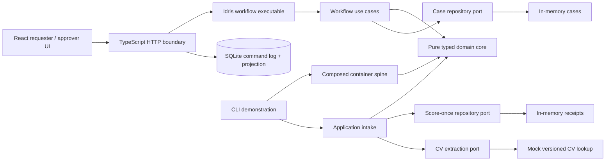

# Architecture

## Scope and flow

One application, a small mathematical-container module, a pure domain core, application services and deterministic adapters. The preparation documents motivate prompt-dependent replies and composable handlers. The implemented container algebra is described in [the walkthrough](containers.md).

Slice 1 introduces a React interface and TypeScript HTTP boundary for requisitions and approvals. Protected writes cross a versioned process boundary into the compiled Idris workflow executable. SQLite retains an append-only command log and read projection; startup replay through Idris validates durable reconstruction. See [the Slice 1 design](slice-1.md).

`Core` imports only other core modules and bundled pure data libraries. It has no IO, clock, filesystem, SQL, HTTP, provider SDK, or application-service imports. A lint check guards that dependency direction. Every domain and application module uses `%default total`; the package uses `--total -Werror` and the hygiene check rejects unsafe proof escapes and holes.

## Five stages

1. `newDraft` validates role, department, positive headcount, positive budget in minor units, and justification. `submit` allocates a reference supplied by the boundary and returns a dependent pair `(r ** Pending r)`. The opaque `Pending r` carries mandatory `Evidence Submitted`.
2. `decide` returns `Ruling r`: approval evidence, decline evidence with a nonblank reason, or held evidence with a nonblank reason. `revise` requires `Held r`, retains the reference, increments the revision, and returns revision evidence. It cannot carry the old approval to the new revision.
3. `publish` requires `Approved r`. It validates positive/unique question and skill IDs, nonempty question and skill lists, nonblank prompts/expected answers/keywords, and positive weights and target years. The opaque advert owns these values and required publication evidence. No edit operation exists.
4. `receive` returns `Application a`. `Answers (questionsOf a)` and `Experience (skillsOf a)` follow the actual ordered lists, including their contents. Raw entries must name every ID exactly once in the advertised order; missing, extra, duplicate, or reordered entries fail validation. Blank answers and empty extracted CV text are allowed so completeness can measure them. A CV locator and immutable version are required.
5. `compute` returns an opaque `Score a`, retaining the application and four-part breakdown. `applyAndScore` performs validation, extraction, application construction, scoring and required evidence within the repository's score-once operation. No hiring outcome is produced.

The type of `Extractor.extract` is `(input : CVInput) -> Either DomainError (CVText input)`: its reply depends on its prompt. The repository and workflow APIs similarly use prompt-dependent values. `ExtractionC` and `extractionAgent` expose that port as a mathematical container and direct-answer handler. The five-link `Spine` composes domain agents with sequence and sum; operational use cases retain state across separate actions.

## Persistence and concurrency

For Slice 1, SQLite stores an append-only log of versioned workflow commands, a requisition projection, and ordinal audit entries. The TypeScript boundary replays the complete command log through the Idris executable before every protected write and on startup. A database transaction then persists the accepted command, updated projection, and new evidence together. Expected generations are checked in Idris and again in the transaction. In-process serialization prevents overlapping writes in the local server; PostgreSQL transactions and tenant-aware constraints remain required for a horizontally scaled deployment.

`CaseRepository` stores a case aggregate with stage, generation and audit history. `start` obtains a proposed fresh reference and inserts generation zero. `review`, `resubmit`, and `advertise` load the current generation, enforce the current stage, and commit via compare-and-swap. Generation advances on every transition; requisition revision advances only on rework. A losing concurrent writer must retry from a fresh load. Reference allocation collisions are also rejected by commit. One advert per requisition is the phase-1 policy; its numeric ID is the requisition reference.

`Repository a state` is scoped to an immutable advert. Its `commitOnce` contract uses application ID as the key and compares the complete raw payload. An equal retry returns the original receipt without invoking extraction or scoring; a different payload is an idempotency conflict. A new receipt and its audit evidence are committed together. The in-memory adapter uses immutable state and a delayed computation to implement this sequentially. It cannot implement cross-process transactions or durability.

The future database adapter must use unique constraints, transactional generation checks, immutable advert snapshots, and an atomic application/score/audit transaction. CV versions must resolve to immutable content. For expensive external extraction, design explicit pending/complete states or an outbox; do not hold a database transaction open across an unbounded model call. Exactly-once external execution after a crash is not promised here.

## Compiler guarantees and their limits

| Compiler or module-boundary guarantee | Runtime, adapter, or trust responsibility |
|---|---|
| An advert needs approval indexed by its exact requisition value | The reviewer is authorized; the decision reflects the latest persisted state |
| Applications/scores/stores cannot be silently reindexed to another advert | Database rows point to immutable complete advert snapshots and reconstruct them safely |
| Answer/experience types retain the ordered question/skill values | User input is checked against those values; IDs and stored content are authentic |
| Successful core transitions supply evidence of the required event kind | Evidence actor/time/detail are true; persistence retains it atomically |
| Scores have private constructors and retain their source application | The deterministic scoring policy is appropriate and tested |
| The pure core is total and effects are outside it | Compiler/runtime correctness, resource limits and availability |

Types do not prevent explicit reconstruction of a new application from raw data, deliberate source changes that weaken the API, erasing indices into DTOs, or comparing two extracted numeric totals. They prevent silent substitution within the typed API. They do not establish fairness, candidate truthfulness, authorization, or legal compliance.

Pure values are reusable. The core cannot revoke an old approval, consume a pending value globally, prove that an actor clicked once, or prevent a caller from forking an old memory snapshot. Use cases enforce current-state transitions; adapters own concurrency and uniqueness. Likewise `compute` is callable repeatedly; the application boundary provides score-once behavior for a retained repository state.

The trust boundary includes each repository implementation: the interface specifies its transaction contract, but Idris does not prove the SQL implementation obeys it. `Evidence event` proves the evidence field exists for that event; its numeric references and prose contents are tested conventions, not dependent equality proofs.

## Deterministic scoring policy v1

All points are nonnegative integers. Totals are raw points, not percentages or normalized rankings.

- **Keywords:** once per skill, add its weight if its trimmed, lowercase keyword is a substring of the trimmed, lowercase CV text. Repetition adds nothing. This deliberately simple policy can match `sql` inside `nosql`; it is an illustrative rule, not semantic CV understanding.
- **Experience:** for each skill, multiply its weight by the smaller of supplied years and target years.
- **Screening:** add ten points per answer matching the expected answer after trimming and lowercasing.
- **Completeness:** one point per nonblank answer, plus one for nonblank extracted CV text.

The demo gives `5 + 18 + 20 + 3 = 46`. Policy identity is `recruitment-score-v1`, included in the receipt's audit detail. Policy changes must receive a new version and an explicit migration policy; stored receipts are returned on retry, not silently recomputed. Scores support human review and never authorize a hire.

## Serialization and input limits

`Adapters.Codec` encodes only `RawApplication`, using a versioned sequence of length-prefixed fields. UTF-8 is the transport encoding; lengths count Unicode characters, not bytes. Delimiters and newlines inside values round-trip. The decoder requires canonical decimal numbers, rejects trailing data/unknown versions, and limits the full message to 100,000 characters and numbers to 20 digits. The encoder rejects values outside the same limits rather than generating undecodable output.

Decoding yields untrusted input, not `Approved`, `Advert`, `Application`, or `Score`. Intake must validate it against the actual loaded advert. Durable aggregate serialization and proof reconstruction are deliberately not implemented; loading an integer ID is insufficient to establish advert equality. A production adapter will need a schema/version registry, checked reconstruction, and an existential package retaining the exact advert with its dependent applications and receipts.

## Error vocabulary

Errors are an algebraic data type, never exception strings inside the core. Their `Show` forms are stable CLI labels for this phase, not a published HTTP contract.

| Error | Meaning |
|---|---|
| `InvalidField name` | Missing/invalid requisition field or actor |
| `InvalidReference` | Zero requisition, advert, or application ID |
| `InvalidReason` | Hold/decline requires nonblank justification |
| `InvalidSchema reason` | Empty/duplicate/invalid question or skill definition |
| `AnswerMismatch`, `SkillMismatch` | Input IDs/order/cardinality do not match the advert |
| `InvalidCV`, `ExtractionFailed` | Invalid input reference or unavailable mock extraction |
| `IdempotencyConflict` | Same application key, different raw payload |
| `PersistenceFailed` | Adapter cannot commit |
| `InvalidEncoding` | Invalid/unsupported/out-of-bounds wire input |
| `NotFound`, `StaleVersion`, `WrongStage` | Missing aggregate, concurrent/stale request, invalid transition |

## Assumptions for this slice

Budgets use one installation-wide currency, expressed in minor units; no foreign exchange. Years are whole nonnegative years, not dates. Context carries an externally supplied actor and logical timestamp (`Nat`), not an authenticated identity or a trusted wall clock. Mock CV input is versioned text lookup, not file upload. Decline is terminal; only hold permits rework. There is no edit-after-publication API. These choices are intentional scope limits for phase 1.
