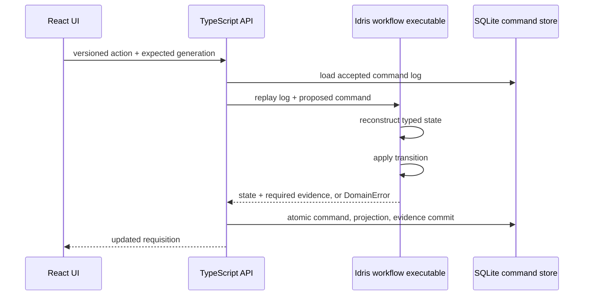

# Slice 1: requisitions and approvals

## User outcome

A requester can save and edit a requisition draft, submit it, respond to requested changes, and resubmit it. An approver can approve, decline, or request changes. Closing and reopening the application retains the complete state and evidence history.

## Write path

The database projection exists for reads and display. It is not accepted as proof-bearing workflow state. At startup, the API replays the append-only command log through Idris and compares the reconstructed cases and evidence with the SQLite projection. A mismatch stops startup.

## Protected transitions

| Command | Required stage | Result |
|---|---|---|
| `create-draft` | no existing case | editable draft with a stable reference |
| `update-draft` | draft | updated fields and advanced generation |
| `submit-draft` | draft | revision zero awaiting review |
| `review approve` | awaiting review | approval evidence for the exact revision |
| `review hold` | awaiting review | required rework reason and held evidence |
| `review decline` | awaiting review | terminal decline evidence |
| `resubmit` | needs rework | next revision awaiting review |

Every command includes an expected aggregate generation. Both Idris replay and the database transaction reject stale generations. The API serializes writes inside one process; the database comparison remains the final defense.

## Trust boundary

The `x-demo-actor` and `x-demo-role` headers support the Slice 1 role switch. They demonstrate authorization routing but are not trustworthy identity. A hosted release must replace them with authenticated sessions or SSO claims and ensure only the workflow service can write protected tables.

SQLite is a local adapter using Node's built-in SQLite module. A hosted multi-user version should replace it with PostgreSQL while preserving the command-log, generation-check, atomic-audit, and Idris-replay contracts.

## Acceptance coverage

- create and edit a Unicode/multiline draft;
- submit, request changes, revise, resubmit, and approve;
- prevent requester review actions;
- reject a stale review;
- propagate Idris validation failures through the HTTP API;
- close and reopen the database; and
- reconstruct the approved revision and complete audit history from the command log.
