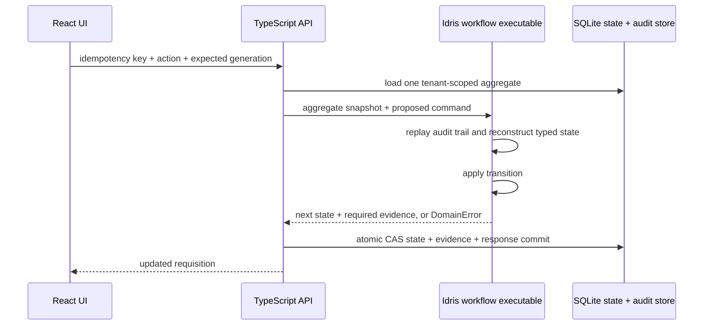

# Slice 1: requisitions and approvals

## User outcome

A requester can save and edit a requisition draft, submit it, respond to requested changes, and resubmit it. An approver can approve, decline, or request changes. Closing and reopening the application retains the complete state and evidence history.

## Correspondence to the delivery plan

| Plan item for the first slice | Where it lives |
|---|---|
| Create draft, edit, submit | `POST /api/requisitions`, `PUT /api/requisitions/:ref`, `POST …/submit`; requester form in the UI |
| Approve, decline, request changes with reasons | `POST …/review`; reasons required for decline and hold, enforced in Idris |
| Revise and resubmit | `POST …/resubmit`; same reference, next revision |
| Close and reopen, recover the complete history | SQLite state and audit; replay on every write; restart tests at the HTTP and browser level |
| Requester interface, approver inbox, requisition detail | React app: requester list, "Awaiting your review" inbox, detail with facts and timeline |
| Status and revision history, audit timeline | Stage badge, revision field, per-event timeline with actor, revision and time |
| Stale-update handling | Generation compare-and-swap in Idris and SQLite; `409 stale-version` |
| Role-based permissions | Requester/approver checks, owner scoping, separation of duties |
| End-to-end browser tests | `tests/end-to-end/`, run with `make e2e` and in CI |

Platform items the plan lists before this slice (PostgreSQL, real authentication, outbox, JSON transport) are deliberately scoped in [ADR 009](adr/009-slice-1-platform-scope.md).

## Write path

SQLite state is authoritative for persistence and reads. It crosses into Idris only through checked reconstruction: the worker replays the aggregate's complete audit trail and can rebuild `Pending`, `Approved`, or `Held` only if the trail is a legal run for this reference, every ruling came from someone other than the submitter, and the current fields are the submitted ones. A stored stage label that disagrees with the replay is refused as `invalid-history`. Inside the worker, the command is routed by `dispatch : Handler TransitionC WorkerC` to one branch of a `Sum` of command containers; see [the container walkthrough](containers.md#the-live-write-path). Audit rows remain append-only. Historical Slice 1 commands are preserved in `legacy_command_log` during migration but are no longer executed under newer business rules.

## Protected transitions

| Command | Required stage | Result |
|---|---|---|
| `create-draft` | no existing case | editable draft with a stable reference |
| `update-draft` | draft | updated fields and advanced generation |
| `submit-draft` | draft | revision zero awaiting review |
| `review approve` | awaiting review, reviewer is not the submitter | approval evidence for the exact revision |
| `review hold` | awaiting review | required rework reason and held evidence |
| `review decline` | awaiting review | terminal decline evidence |
| `resubmit` | needs rework | next revision awaiting review |

Every command includes an expected aggregate generation. Both the Idris transition and the database transaction reject stale generations. The API serializes writes inside one process; SQLite `BEGIN IMMEDIATE`, compare-and-swap updates, and unique idempotency records remain the cross-process defenses.

## Trust boundary

The `x-demo-actor`, `x-demo-role`, and `x-demo-tenant` headers support the demo role switch. They are not trustworthy identity. Separation of duties is enforced by actor, not by role: an approver-role request from the actor who submitted the revision is refused with `403 self-review-forbidden`. Reads are tenant scoped; requester reads and mutations are additionally owner scoped. A hosted release must derive these values from authenticated sessions or SSO claims and enforce tenant isolation in PostgreSQL as defense in depth.

Mutations require an `Idempotency-Key`. The `(tenant, actor, key)` record binds the operation and canonical request fingerprint to the original response in the same transaction as state and audit. An equal retry returns that response; reuse with another request returns a conflict.

SQLite is a local adapter using Node's built-in SQLite module. Ordered migrations are recorded in `schema_migrations`. A hosted multi-user version should replace it with PostgreSQL while preserving generation checks, atomic state/audit/idempotency commits, and the single-aggregate Idris transition contract.

## Acceptance coverage

- create and edit a Unicode/multiline draft;
- submit, request changes, revise, resubmit, and approve;
- prevent requester review actions;
- reject a stale review;
- propagate Idris validation failures through the HTTP API;
- close and reopen the database while retaining the approved revision and audit history;
- return the original result for equal mutation retries and reject conflicting key reuse;
- isolate tenants and requester-owned requisitions;
- refuse self-review when the submitter switches to the approver role;
- refuse a mutation on a directly tampered row whose audit trail is not a legal run;
- converge on one result when two application processes receive the same create; and
- migrate a Slice 1 database without losing state, audit history, ownership, or reference allocation.

Browser journeys (`make e2e`) drive the built application in Chrome: create, edit and submit; the approver inbox; a reason required before requesting changes; revise and resubmit as revision 1; approve; reload and recover the full seven-event timeline; and a terminal decline seen from both roles.
